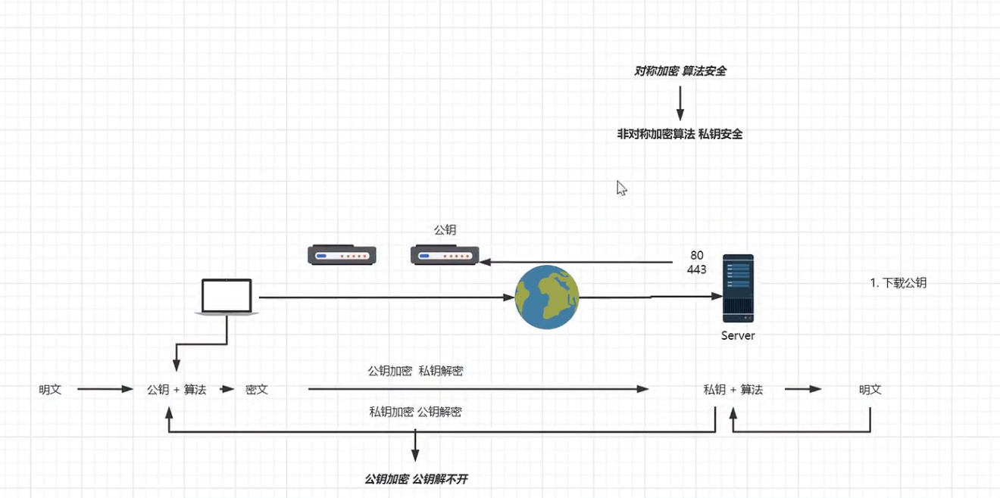
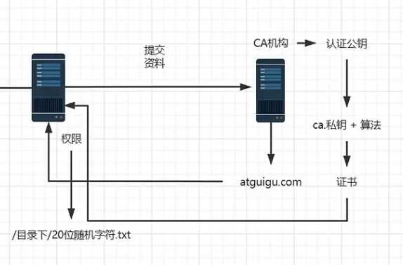

# HTTPs

## 非对称加密

  

CA机构对公钥进行认证

  

1. 申请证书，提交证明材料
2. CA机构判断申请人是否是服务器拥有者，即是否有权限在某个目录下放文件
3. CA机构将服务器公钥使用自己的私钥进行加密，生成证书，返回给服务器
4. 用户对服务器发起请求时，服务器将证书发给用户
5. 用户通过操作系统内置的CA机构的公钥将证书解密生成服务器公钥
6. 使用服务器公钥加密传输数据

## 内网使用

自签名 openSSL

## 在线证书

将签发的证书下载后，将.key文件和.pem文件上传到nginx的conf目录下，然后修改配置

```conf
server {
    listen 443 ssl;
    server_name localhost;  # 接收所有访问443端口的请求
    ssl_certificate 7706851_www.xzj520520.cn.pem;
    ssl_certificate_key 7706851_www.xzj520520.cn.key;
}
```

重启nginx

## http跳转https

```conf
server {

 listen 80;
 server_name www.xzj520520.cn xzj520520.cn; # 换成自己的域名
 ...

 return 301 https://$server_name$request_uri; 

}
```
