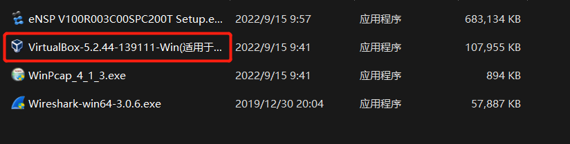
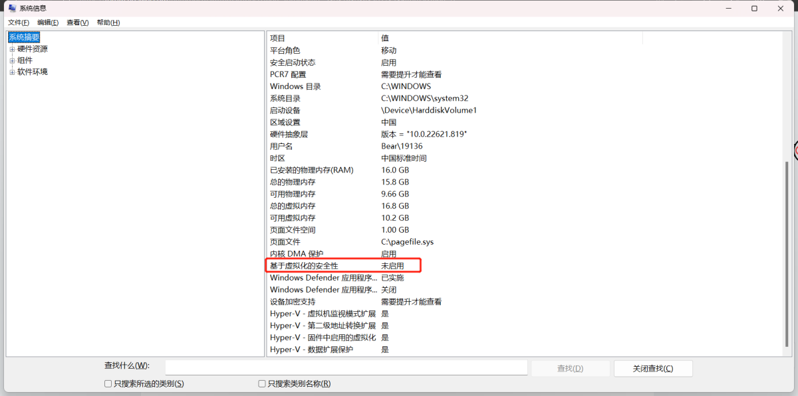

# ENSP 安装

安装ensp及组件，对于W11系统，VirtualBox建议安装ensp最高能支持的版本5.2.44

  

## 问题

1. 安装完成后试着开启AR，如果40报错，删除AR设备，点击右上角菜单-->工具-->注册设备，选择AR注册

2. 右键VirtualBox-->属性-->兼容性-->勾选以管理员身份运行此程序

3. 关闭虚拟化Hyper-V功能，点击开始-->搜索系统信息
如果状态是正在运行，表示开启了Hyper-V功能，需要关闭该功能。
  
通过Win+x以管理员运行终端，输入命令bcdedit /set hypervisorlaunchtype off，然后重启电脑

## 网络问题

1. 网络适配器中出现 virtual box adapter # 2 ； 使用工具runasTI 赋予超级权限，将注册表中`计算机\HKEY_LOCAL_MACHINE\SYSTEM\CurrentControlSet\Control\NetworkSetup2`的adapter 删掉，再在virtual box中重新添加网卡
2. 